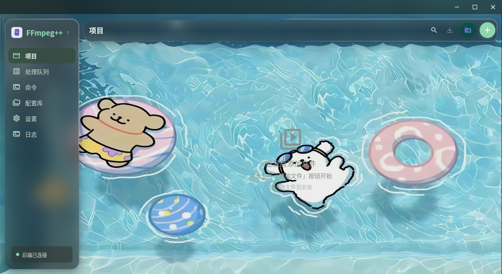
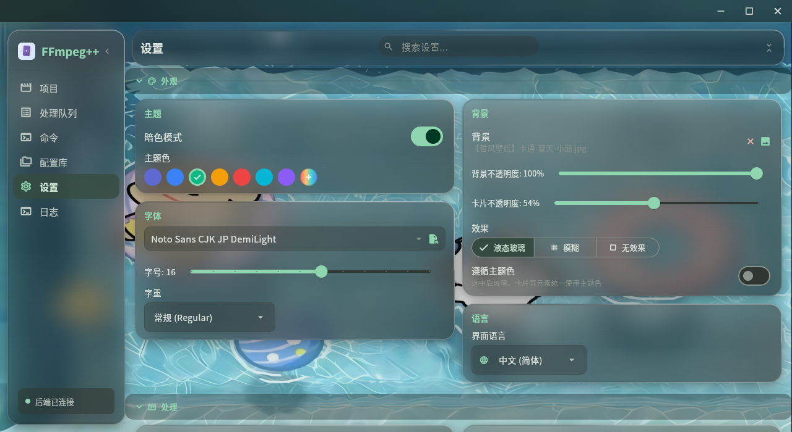
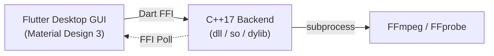

<div align="center">

<h1>🎬 FFmpeg++</h1>

<p><strong>专业视频 / 图片 / 音频处理桌面应用 — 100% AI 生成代码</strong></p>

<p>
  <a href="https://flutter.dev"></a>
  <a href="https://flutter.dev"></a>
  <a href="https://isocpp.org"></a>
  <a href="https://ffmpeg.org"></a>
  <a href="LICENSE"></a>
</p>

<p>
  <a href="#chinese">🇨🇳 中文</a> ·
  <a href="#english">🇬🇧 English</a>
</p>

<blockquote>
<p>🤖 <strong>本项目代码 100% 由 AI 生成</strong></p>
</blockquote>

</div>

---

## 📸 软件预览

<table>
  <tr>
    <td align="center"><b>🎬 主界面</b></td>
    <td align="center"><b>📋 使用演示</b></td>
  </tr>
  <tr>
    <td></td>
    <td></td>
  </tr>
</table>

---

## 🗂 目录

- [🇨🇳 中文](#chinese)
- [🇬🇧 English](#english)

---

## 中文 <a id="chinese"></a>

### 📖 概述

FFmpeg++ 是一款基于 **Flutter**（Material Design 3 前端）+ **C++17**（共享库后端，通过 FFI 加载）的跨平台桌面视频/图片/音频处理工具。核心功能为蓝图式**节点编辑器**，支持构建复杂的多步骤处理流程。

支持 **Windows**、**Linux**（x64 / ARM64）、**macOS**（Universal）三大平台。

### 🏗 架构



### ✨ 核心亮点

<table>
  <tr>
    <td align="center" width="33%">🧩<br><b>蓝图式节点编辑器</b><br>25+ 节点，无限 DAG 画布</td>
    <td align="center" width="33%">⚡<br><b>GPU 硬件加速</b><br>NVIDIA / AMD / Intel</td>
    <td align="center" width="33%">🤖<br><b>AI 助手</b><br>自然语言生成处理节点</td>
  </tr>
  <tr>
    <td align="center" width="33%">🎞️<br><b>17+ 编码器</b><br>H.264 / H.265 / AV1 / VP9</td>
    <td align="center" width="33%">📝<br><b>字幕烧录</b><br>SRT / ASS / SSA + 字体预览</td>
    <td align="center" width="33%">🖥️<br><b>跨平台</b><br>Windows / Linux / macOS</td>
  </tr>
</table>

### ✨ 功能

| 模块 | 说明 |
|------|------|
| 🎬 **项目** | 多视频导入、ffprobe 自动探测、缩略图预览 |
| 📋 **处理队列** | 顺序批量处理、实时进度解析 |
| 🧩 **节点编辑器** | 蓝图式 DAG 画布，25+ 节点类型，构建复杂多步骤处理流程 |
| 🎞 **视频转码** | 17+ 编码器（H.264/H.265/AV1/VP9/SVT-AV1），GPU 加速（NVIDIA/AMD/Intel）|
| 🎵 **音频处理** | 转码 / 变速 / 音量调整 / 动态压缩 / 元信息编辑 / 提取音频（带预览播放）|
| 📝 **字幕** | 烧录外挂 SRT/ASS/SSA，拾色器，系统字体选择器（含预览）|
| 📷 **帧提取** | 单帧 / 范围分帧 / 全部分帧 |
| ✂️ **片段截取** | 时间范围截取，级联时长约束 |
| 🖼 **图片处理** | 格式转换 / 裁剪 / 旋转 / 缩放 / 亮度 / 噪点 / 锐化 / 降噪 / 通道提取 |
| 🎬 **视频裁剪** | 交互式选区工具，支持多选区、拖拽调整、保留/移除模式 |
| 🔗 **合并媒体** | 多文件顺序合并，图片序列合成视频 |
| 🧠 **命令** | 手动输入 ffmpeg 命令 + 快捷模板 + 参数参考 |
| 🤖 **AI 助手** | 内置 AI 聊天面板，自然语言描述需求自动配置节点 |
| ⚙️ **设置** | 暗/亮主题、字体、主题色、背景图片、编辑模式切换 |

### 🧩 节点编辑器

节点编辑器是 FFmpeg++ 的核心。详见 **[NODE_EDITOR.md](NODE_EDITOR.md)**。

- 无限画布，支持平移缩放
- 拖拽节点，自由连线
- 右键添加节点 / 删除连线
- 25+ 节点类型覆盖视频、音频、图片处理
- 自动验证（环路检测、类型冲突、时长约束）
- 智能合并：音视频处理 + 字幕 = 单条 ffmpeg 命令
- 逻辑块：循环处理支持
- 调试覆盖层显示执行计划
- 多源文件节点 = 多个独立任务

### 📦 安装

| 平台 | 下载 |
|------|------|
| 🪟 **Windows** | [](https://github.com/lvbaoshigao/FFmpeg_plus_plus/releases) |
| 🐧 **Linux x64** | [](https://github.com/lvbaoshigao/FFmpeg_plus_plus/releases) |
| 🐧 **Linux ARM64** | [](https://github.com/lvbaoshigao/FFmpeg_plus_plus/releases) |
| 🍎 **macOS** | [](https://github.com/lvbaoshigao/FFmpeg_plus_plus/releases) |

> 确保已安装 [FFmpeg](https://ffmpeg.org/download.html) 并加入 PATH 环境变量。

### 🔧 开发

#### 环境要求

- [Flutter SDK](https://flutter.dev) 3.44+
- [CMake](https://cmake.org) 3.20+
- [FFmpeg](https://ffmpeg.org) 在 PATH 中
- **Windows**: Visual Studio 2022/2025，含 C++ 桌面开发工作负载；[Inno Setup](https://jrsoftware.org/isinfo.php) 6+
- **Linux**: `cmake g++ libgtk-3-dev pkg-config ninja-build`
- **macOS**: Xcode Command Line Tools

#### 开发模式

```bash
# 1. 编译 C++ 后端
cd server_cpp
mkdir -p build && cd build
cmake .. -DCMAKE_BUILD_TYPE=Release
make -j$(nproc)    # Linux/macOS
# Windows: cmake --build . --config Release

# 2. 启动 Flutter GUI
cd ../../ffmpegpp_gui
flutter pub get
flutter run -d linux   # 或 -d windows / -d macos
```

#### 🤖 Android 移动端

移动端适配只影响 Android 平台，桌面端行为不变：

- **底部液态玻璃导航栏**：PC 左侧边栏在移动端移至底部，选中项为可拖动
  胶囊遮罩（水平拖动 → 松手吸附最近项并跳转，逻辑与 PC 侧边栏一致）。
- **命令 / 日志移入设置**：底部栏只保留 项目 / 处理队列 / 配置库 / 设置，
  命令与日志在 设置 → 工具 中进入。
- **Monet 动态取色**：Android 8.1+ 跟随系统壁纸生成 Material You 配色
  （设置 → 外观 → 动态取色 可关闭），参考 Android 16 莫奈风格。
- **内置 FFmpeg**：ffmpeg / ffprobe 以 arm64 静态可执行文件打包进 APK
  （jniLibs），C++ 后端通过子进程调用，无需用户安装任何东西。
- **触屏适配**：项目页禁用桌面拖放、节点编辑器顶部返回栏、状态栏/手势
  区安全边距等。

构建 APK（需 Android SDK + NDK r26d + JDK 17+）：

```bash
# 一键构建全部（桌面端 + Android APK）
build/build_all.sh all

# 只构建 Android APK（自动修补 file_picker compileSdk、自动重试防 OOM）
build/build_all.sh android

# 分步：先交叉编译内置 ffmpeg/ffprobe + C++ 后端（产物在缓存根 dist/）
build/android/build_ffmpeg.sh
# 再构建 APK
build/android/build_apk.sh

# 产物: ffmpegpp_gui/build/app/outputs/flutter-apk/app-release.apk (arm64-v8a)
```

> 构建脚本集中在 `build/`（详见 `build/README.md`）：代码在仓库、缓存/工具链在
> sdb2，路径均可通过 `FFMPEGPP_CACHE`/`FFMPEGPP_ROOT` 等环境变量覆盖。

> 说明：桌面端更新机制/安装器不适用于移动端，设置页已做对应隐藏与提示；
> GPU 硬编码器（NVIDIA/AMD/Intel）在 Android 上不可用，自动回退 CPU 编码。

### 🛠 技术栈

| 层级 | 技术 |
|------|------|
| UI 框架 | Flutter 3.44, Material Design 3 |
| 状态管理 | Provider (ChangeNotifier) |
| 后端 | C++17, 编译为共享库 (dll/so/dylib), 通过 Dart FFI 加载 |
| 视频引擎 | FFmpeg 8.0 / ffprobe |
| 音频预览 | just_audio (GStreamer on Linux) |
| 安装包 | Inno Setup (Windows) / dpkg-deb (Linux) / hdiutil (macOS) |
| CI/CD | GitHub Actions — Windows / Linux x64 / Linux ARM64 / macOS |
| 代码生成 | 100% AI 生成（Claude）|

### ⭐ Star 历史

<a href="https://star-history.com/#lvbaoshigao/FFmpeg_plus_plus&Date">
  <picture>
    <source media="(prefers-color-scheme: dark)" srcset="https://api.star-history.com/svg?repos=lvbaoshigao/FFmpeg_plus_plus&type=Date&theme=dark" />
    <source media="(prefers-color-scheme: light)" srcset="https://api.star-history.com/svg?repos=lvbaoshigao/FFmpeg_plus_plus&type=Date" />
    
  </picture>
</a>

### 📄 许可证

MIT License — 详见 [LICENSE](LICENSE)

---

## English <a id="english"></a>

### 📸 Software Preview

<table>
  <tr>
    <td align="center"><b>🎬 Main</b></td>
    <td align="center"><b>📋 Demo</b></td>
  </tr>
  <tr>
    <td></td>
    <td></td>
  </tr>
</table>

### 📖 Overview

FFmpeg++ is a cross-platform desktop tool for video, image, and audio processing. Built with **Flutter** (Material Design 3 frontend) and **C++17** (shared library backend via FFI), featuring a blueprint-style **node editor** with 25+ node types for complex processing workflows.

Supports **Windows**, **Linux** (x64 / ARM64), and **macOS** (Universal).

### 🏗 Architecture


### ✨ Key Highlights

<table>
  <tr>
    <td align="center" width="33%">🧩<br><b>Blueprint Node Editor</b><br>25+ nodes, infinite DAG canvas</td>
    <td align="center" width="33%">⚡<br><b>GPU Acceleration</b><br>NVIDIA / AMD / Intel</td>
    <td align="center" width="33%">🤖<br><b>AI Assistant</b><br>Natural language to nodes</td>
  </tr>
  <tr>
    <td align="center" width="33%">🎞️<br><b>17+ Codecs</b><br>H.264 / H.265 / AV1 / VP9</td>
    <td align="center" width="33%">📝<br><b>Subtitle Burn-in</b><br>SRT / ASS / SSA + font preview</td>
    <td align="center" width="33%">🖥️<br><b>Cross-platform</b><br>Windows / Linux / macOS</td>
  </tr>
</table>

### ✨ Features

| Module | Description |
|--------|-------------|
| 🎬 **Projects** | Multi-video import, auto ffprobe probing, thumbnail preview |
| 📋 **Queue** | Sequential batch processing, real-time progress parsing |
| 🧩 **Node Editor** | Blueprint-style DAG canvas, 25+ node types for complex workflows |
| 🎞 **Transcode** | 17+ codecs (H.264/H.265/AV1/VP9/SVT-AV1), GPU acceleration (NVIDIA/AMD/Intel) |
| 🎵 **Audio** | Transcode / speed / volume / dynamic compressor / metadata / extract audio (with playback preview) |
| 📝 **Subtitles** | Burn-in external SRT/ASS/SSA, color picker, system font selector with preview |
| 📷 **Frames** | Single frame / range / full video decomposition |
| ✂️ **Clipping** | Time-range extraction with cascading duration constraints |
| 🖼 **Image** | Format convert / crop / rotate / scale / brightness / noise / sharpen / denoise / channel extract |
| 🎬 **Video Crop** | Interactive selection tool with multi-region, drag-resize, keep/remove modes |
| 🔗 **Concat** | Multi-file sequential merge, image sequence to video |
| 🧠 **Command** | Manual ffmpeg command input with templates & parameter reference |
| 🤖 **AI Assistant** | Built-in AI chat panel, describe what you want in natural language |
| ⚙️ **Settings** | Dark/Light theme, fonts, accent colors, background image, editor mode toggle |

### 🧩 Node Editor

The node editor is the core of FFmpeg++. See **[NODE_EDITOR.md](NODE_EDITOR.md)** for full documentation.

- Infinite canvas with pan & zoom
- Drag-and-drop nodes, freeform connections
- Right-click to add nodes, right-click connections to delete
- 25+ node types covering video, audio, and image processing
- Automatic validation (cycle detection, type conflicts, duration constraints)
- Smart merge: AV processing + subtitle burn = single ffmpeg command
- Logic blocks: loop processing support
- Debug overlay showing execution plan
- Multiple source nodes = multiple independent tasks

### 📦 Installation

| Platform | Download |
|----------|----------|
| 🪟 **Windows** | [](https://github.com/lvbaoshigao/FFmpeg_plus_plus/releases) |
| 🐧 **Linux x64** | [](https://github.com/lvbaoshigao/FFmpeg_plus_plus/releases) |
| 🐧 **Linux ARM64** | [](https://github.com/lvbaoshigao/FFmpeg_plus_plus/releases) |
| 🍎 **macOS** | [](https://github.com/lvbaoshigao/FFmpeg_plus_plus/releases) |

> Make sure [FFmpeg](https://ffmpeg.org/download.html) is installed and in your PATH.

### 🔧 Development

#### Prerequisites

- [Flutter SDK](https://flutter.dev) 3.44+
- [CMake](https://cmake.org) 3.20+
- [FFmpeg](https://ffmpeg.org) in PATH
- **Windows**: Visual Studio 2022/2025 with C++ Desktop workload; [Inno Setup](https://jrsoftware.org/isinfo.php) 6+
- **Linux**: `cmake g++ libgtk-3-dev pkg-config ninja-build`
- **macOS**: Xcode Command Line Tools

#### Quick Start

```bash
# 1. Build C++ backend
cd server_cpp
mkdir -p build && cd build
cmake .. -DCMAKE_BUILD_TYPE=Release
make -j$(nproc)    # Linux/macOS
# Windows: cmake --build . --config Release

# 2. Run Flutter GUI
cd ../../ffmpegpp_gui
flutter pub get
flutter run -d linux   # or -d windows / -d macos
```

### 🛠 Tech Stack

| Layer | Technology |
|-------|-----------|
| UI Framework | Flutter 3.44, Material Design 3 |
| State Management | Provider (ChangeNotifier) |
| Backend | C++17, compiled to shared lib (dll/so/dylib), loaded via Dart FFI |
| Video Engine | FFmpeg 8.0 / ffprobe |
| Audio Preview | just_audio (GStreamer on Linux) |
| Installer | Inno Setup (Windows) / dpkg-deb (Linux) / hdiutil (macOS) |
| CI/CD | GitHub Actions — Windows / Linux x64 / Linux ARM64 / macOS |
| Code Generation | 100% AI-generated via Claude |

### ⭐ Star History

<a href="https://star-history.com/#lvbaoshigao/FFmpeg_plus_plus&Date">
  <picture>
    <source media="(prefers-color-scheme: dark)" srcset="https://api.star-history.com/svg?repos=lvbaoshigao/FFmpeg_plus_plus&type=Date&theme=dark" />
    <source media="(prefers-color-scheme: light)" srcset="https://api.star-history.com/svg?repos=lvbaoshigao/FFmpeg_plus_plus&type=Date" />
    
  </picture>
</a>

---

<div align="center">
  <sub>🤖 The code 100% AI-Generated — Built with Flutter , C++</sub>
</div>
