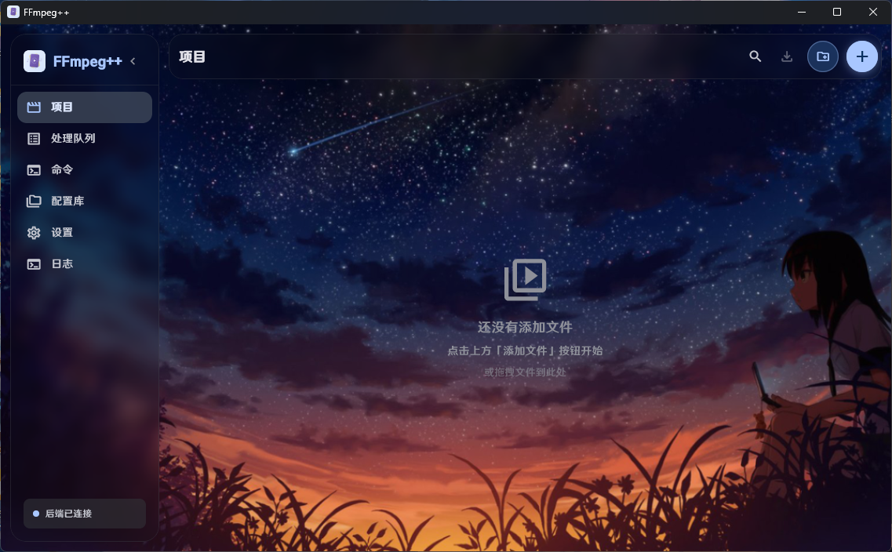
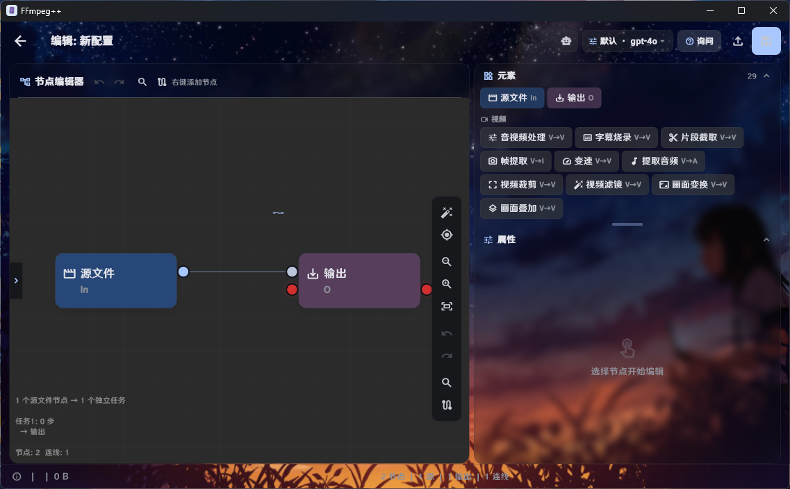

# 🎬 FFmpeg++

<div align="center">

**Blueprint-style node-based audio/video processing for desktop — complex FFmpeg as a workflow you can see**

[](https://flutter.dev)
[](https://flutter.dev)
[](https://isocpp.org)
[](https://ffmpeg.org)
[](LICENSE)

English | [简体中文](README.md)

>  **This project is design by human and wrote by AI **

</div>

---

## 📖 Overview

**FFmpeg++** is a cross-platform video / image / audio processing tool that replaces the burden of
memorizing command-line flags with a **blueprint-style node editor**: place `Start → Process → Output`
nodes on an infinite canvas, wire them together, and the app validates the graph and generates the
matching `ffmpeg` command for you.

The interface is built with **Flutter** and Material Design 3; the processing core is a **C++17**
shared library loaded through Dart FFI. The actual encoding and decoding is still done by
**FFmpeg / ffprobe** — so you keep FFmpeg's power without having to read the manual.

### What it solves

- **Commands get long**: filters, encoders, stream mapping and subtitle burn-in combine into dozens
  of flags that are easy to get wrong by hand.
- **Repetitive work**: the same processing chain across many files usually means maintaining scripts.
- **Opaque pipelines**: a single long command does not show what happens first and what happens next.

With nodes, a processing chain becomes a graph you can see, save, reuse, and share.

### Three ways to work

| Mode | Best for |
|------|----------|
| 🧩 **Node Editor** | Complex multi-step, multi-branch pipelines: transcode + filters + subtitles + audio in one graph |
| 🎚 **Quick Config** | Fast single-file work: pick parameters from presets and send straight to the queue |
| 🧠 **Command Mode** | Full freedom: write raw ffmpeg commands with templates and a parameter reference |

---

## 📸 Software Preview

### Main Window



The Projects page is the entry point: the sidebar switches between Projects / Queue / Command /
Config Library / Settings. Media appears as cards with drag-and-drop import, thumbnail previews and
automatic ffprobe detection (codec, resolution, duration, bitrate). From a selected file you can open
the node editor, apply a quick-config preset, and every processing job lands in the shared queue.

### Node Editor



The node editor is the core workspace: the top toolbar handles save, undo, redo, auto-layout and the
debug view; the center is an infinite canvas where nodes are wired port to port and right-click adds
or removes them; the right panel shows the parameters of the selected node. Every step on the canvas
is translated into a real ffmpeg invocation, validated before anything runs.

---

## 🧩 The Node Editor: How It Works

The whole idea is three steps: **place nodes → connect them → run**.

### Step 1 — Place nodes

Drop processing nodes from the toolbar or the right-click menu. Every pipeline starts with a **Start**
node and ends with an **Output** node; processing nodes go in between:

- **Transcode & filters**: video transcode (codec / bitrate / CRF / resolution / frame rate), video
  filters (brightness, contrast, saturation, gamma, hue, vignette, denoise, sharpen, grayscale),
  geometry (scale / flip / rotate), overlay (watermark / logo with 5-position placement, opacity,
  scale and margin).
- **Audio**: transcode, speed, volume, dynamic compression, fade in/out, metadata, audio extraction.
- **Image**: format conversion, crop, rotate, scale, brightness, adjust (saturation · gamma ·
  contrast), noise, sharpen, denoise, channel extraction.
- **Pacing & trimming**: speed change, time-range clipping, single-frame / range / full frame
  extraction, interactive video crop.
- **Combining**: concatenating multiple files, turning an image sequence into video, subtitle burn-in
  (SRT / ASS / SSA with a color picker and font selector).

### Step 2 — Connect them into a graph

Drag from a port to wire "the output of this step" into "the input of the next". The editor keeps
validating the graph:

- cycle detection, connection type conflicts, dangling nodes, missing Start / Output nodes;
- duration constraints (for example when a clip duration is incompatible with a downstream node);
- adjacent nodes that can be collapsed are automatically merged into a **single ffmpeg command**
  instead of re-encoding several times.

**Logic blocks and logic gates** turn the graph into more than a straight line: loop blocks repeat a
sub-chain by count or condition, while AND / OR / NOT / NAND / NOR / XOR / XNOR gates, constant 1 / 0
and a time trigger act as enable/status inputs that decide whether a processing node runs — giving
your pipeline conditional branching.

### Step 3 — Run and reuse

Each **source node** becomes an independent task, so one graph can be applied to many files at once.
Tasks run sequentially in the processing queue with live progress, speed and remaining time.

Once a graph works, store it in the **Config Library** and export it as a `.fppx` project file to share.
Importing one validates it against your app version and media type.

---

## 🚀 Additional Features

### 🤖 AI Assistant

A built-in AI chat panel lets you describe what you want in natural language (for example, "make this
video smaller and add a watermark") and have the AI create or modify nodes and parameters on the
canvas for you.

Both the **OpenAI** and **Anthropic** protocols are supported, with multiple model profiles and
multi-API-key rotation. Keys are encrypted locally.

### 🔌 MCP Server (Model Context Protocol)

FFmpeg++ embeds an MCP HTTP server (**off by default**) so AI clients and automation workflows can
drive the whole application:

- **Endpoint**: `http://127.0.0.1:<port>/`, JSON-RPC 2.0 over HTTP POST, with batch requests and
  protocol version negotiation;
- **Tools (27)**: canvas operations (`add_node` / `connect_nodes` / `modify_node_params` / `undo` /
  `save` / `rename_node` …), reads (`list_nodes` / `list_connections` / `get_graph_stats` /
  `error_check`), media and files (`probe_video` / `list_directory` / `read_file_info`), tasks
  (`list_tasks` / `get_task_info` / `cancel_tasks`), logic gates (`add_gate` / `set_gate_params`),
  containers (`list_containers` / `get_container_pipeline`) and more;
- **Resources (3)**: `pipeline://current`, `videos://loaded`, `tasks://all`;
- **Permission switches**: Allow Write (off by default — every mutating tool is rejected while off)
  and Allow File Access (on by default; gates directory listing, file info, media probing and log
  reading);
- **Security**: binds `127.0.0.1` only by default; switching to `0.0.0.0` exposes it on the LAN and
  then enforces an access token (`x-mcp-token` header or `Authorization: Bearer <token>`, shown in
  Settings).

> Mainstream desktop MCP clients speak stdio. Bridge with an HTTP ↔ stdio proxy such as `mcp-proxy`
> if you want to connect one directly.

### 📱 Android

The same codebase also builds for Android (arm64-v8a, Android 8.0+) with touch adaptations:

- the sidebar becomes a bottom liquid-glass navigation bar with a draggable selection pill;
- Android 8.1+ supports Monet dynamic color, deriving a Material You palette from the wallpaper;
- **ffmpeg / ffprobe are bundled** as static arm64 executables inside the APK — no external
  dependency to install;
- GPU hardware encoders are unavailable and automatically fall back to CPU encoding.

### 🛠 Other Details

- **Interface**: dark / light themes, accent colors, background images, multiple surface styles
  (liquid glass / blur / solid), fonts and text scale, customizable keyboard shortcuts, Chinese and
  English UI;
- **FFmpeg install helper**: guided setup — winget on Windows, apt / dnf / pacman on Linux, Homebrew
  on macOS, plus importing from an existing archive;
- **Editing experience**: canvas auto-layout, undo / redo, autosave, and a debug overlay showing the
  execution plan;
- **Processing queue**: sequential batch execution, persisted results, per-task cancel and stop-all;
- **App updates**: built-in update check, download and install (SHA-256 verified).

---

## 📦 Download & Installation

FFmpeg++ is available for the following clients:

| Platform | Architecture | Package |
|----------|--------------|---------|
| **Windows** | x64 | `FFmpeg++_v*_setup.exe` |
| **Linux** | x64 | `ffmpegpp_*_amd64.deb` |
| **Linux** | ARM64 | `ffmpegpp_*_arm64.deb` |
| **macOS** | Universal (Intel + Apple Silicon) | `FFmpeg++_v*_macOS.dmg` |
| **Android** | arm64-v8a | `app-release.apk` |

### ⬇️ Get it now

**➡️ [GitHub Releases (all platform installers)](https://github.com/lvbaoshigao/FFmpeg_plus_plus/releases)**

Pick the matching file from the **Assets** section of the release. The Windows installer ships with
Simplified Chinese, Traditional Chinese and English setup wizards; the `.deb` packages install with
`sudo dpkg -i` or `sudo apt install ./*.deb`.

> **About the FFmpeg dependency**: on desktop, if `ffmpeg` / `ffprobe` are not found at first launch
> the app walks you through a one-click install (winget / apt / dnf / pacman / Homebrew) or lets you
> import an existing archive. The Android build bundles everything, so nothing is required.

---

## ⭐ Star History

<a href="https://star-history.com/#lvbaoshigao/FFmpeg_plus_plus&Date">
  <picture>
    <source media="(prefers-color-scheme: dark)" srcset="https://api.star-history.com/svg?repos=lvbaoshigao/FFmpeg_plus_plus&type=Date&theme=dark" />
    <source media="(prefers-color-scheme: light)" srcset="https://api.star-history.com/svg?repos=lvbaoshigao/FFmpeg_plus_plus&type=Date" />
    
  </picture>
</a>

---

## 🔧 Building From Source

<details>
<summary>Expand for requirements, build steps and tech stack</summary>

### Architecture

```
┌──────────────────────────────────┐
│   Flutter GUI (Dart)             │  ← Material Design 3
│   Dart FFI ↔ libffmpegpp         │
├──────────────────────────────────┤
│   C++17 backend (dll / so / dylib)│  ← shared library, message-queue polling
│   subprocess → ffmpeg / ffprobe  │
├──────────────────────────────────┤
│   FFmpeg / FFprobe               │  ← external process
└──────────────────────────────────┘
```

### Prerequisites

- [Flutter SDK](https://flutter.dev) 3.44+
- [CMake](https://cmake.org) 3.20+
- **Windows**: Visual Studio 2022/2025 with the C++ desktop workload, and
  [Inno Setup](https://jrsoftware.org/isinfo.php) 6+
- **Linux**: `cmake g++ libgtk-3-dev pkg-config ninja-build`
- **macOS**: Xcode Command Line Tools
- **Android**: Android SDK + NDK 28.2 + JDK 17+

### Manual build

```bash
# 1. Build the C++ backend
cd server_cpp
mkdir -p build && cd build
cmake .. -DCMAKE_BUILD_TYPE=Release
make -j$(nproc)                 # Linux / macOS
# Windows: cmake .. -G "NMake Makefiles" && nmake

# 2. Run the Flutter GUI
cd ../../ffmpegpp_gui
flutter pub get
flutter run -d linux            # or -d windows / -d macos
```

### One-shot build scripts

Build scripts live in `build/` — see [`build/README.md`](build/README.md):

```bash
build/build_all.sh all          # desktop + Android APK
build/build_all.sh desktop      # desktop only
build/build_all.sh android      # Android APK only
```

Build outputs:

| Platform | Path |
|----------|------|
| Windows | `ffmpegpp_gui/build/windows/x64/runner/Release/` |
| Linux | `ffmpegpp_gui/build/linux/x64/release/bundle/` |
| Android | `ffmpegpp_gui/build/app/outputs/flutter-apk/app-release.apk` |

### Repository layout

```
FFmpeg_plus_plus/
├── ffmpegpp_gui/     # Flutter frontend (UI, state, node editor, MCP server)
├── server_cpp/       # C++17 backend (command generation, process control, .fppx codec, probing)
├── build/            # Unified build scripts (desktop / Android)
├── make/             # Installer script and icon assets
└── .github/          # GitHub Actions release pipeline
```

### Tech stack

| Layer | Technology |
|-------|------------|
| UI framework | Flutter 3.44 · Material Design 3 |
| State management | Provider (ChangeNotifier) |
| Backend | C++17 shared library (dll / so / dylib), loaded via Dart FFI |
| Processing engine | FFmpeg 8.0 / ffprobe (subprocess) |
| Audio preview | just_audio (GStreamer on Linux) |
| Installers | Inno Setup (Windows) · dpkg-deb (Linux) · hdiutil (macOS) |
| CI/CD | GitHub Actions — Windows / Linux x64 / Linux ARM64 / macOS / Android |

</details>

---

<div align="center">

<sub>  AI-Wrote code and desion by human — Built with Flutter + C++ + FFmpeg</sub>

MIT License — 详见 [LICENSE](LICENSE)

</div>
